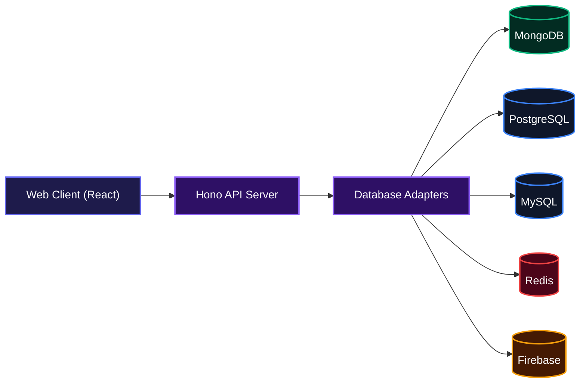
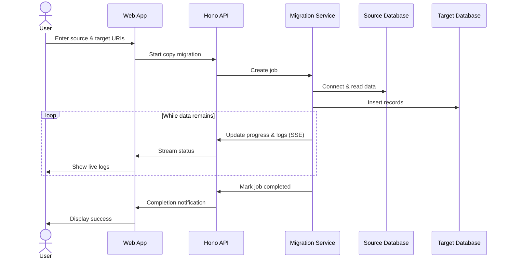
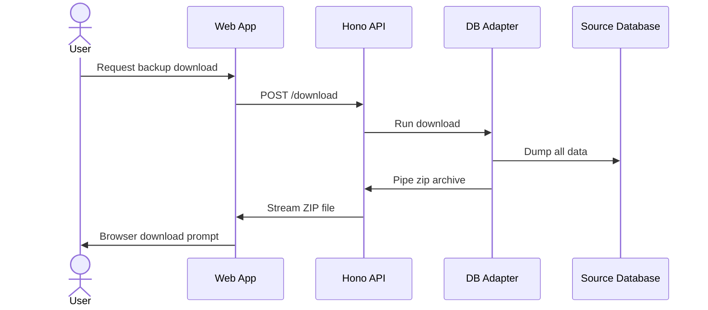
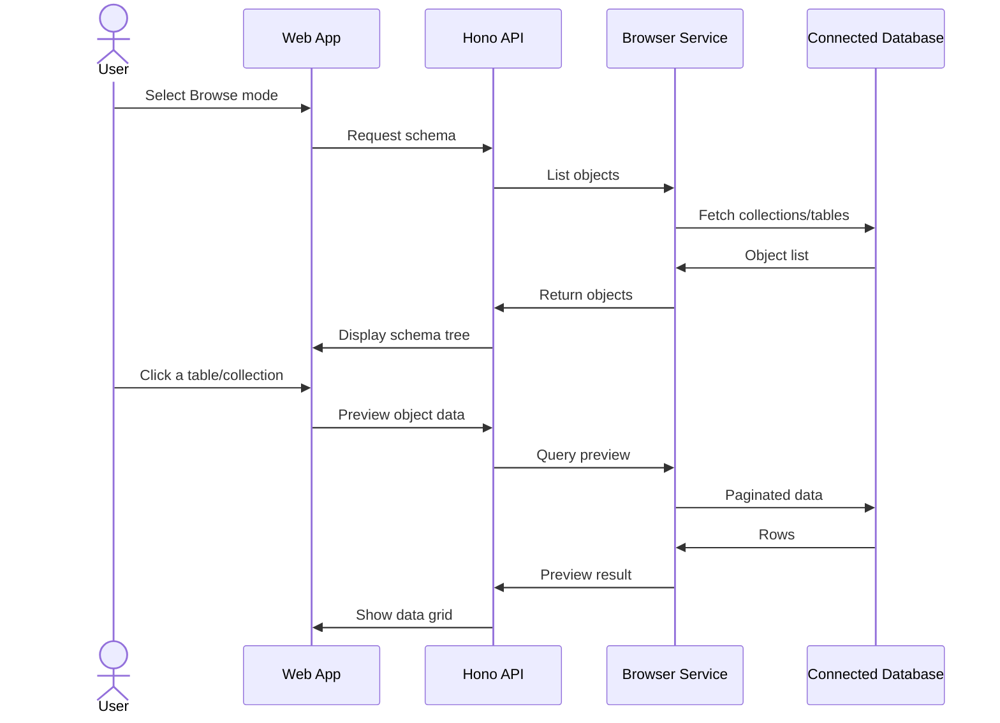

# DB Mover

<div align="center">
  
</div>
Database migration without the CLI maze.

## Overview

DB Mover gives you a visual interface to copy, back up, or browse your databases. Instead of remembering `pg_dump` flags or `mongodump` arguments, you paste your connection strings, hit run, and watch live logs confirm every step. No terminal, no docs rabbit hole, just a straightforward tool that moves data from A to B.


## Architecture



## Features

### Copy source to target in one flow

Move data between two databases of the same engine. The UI guides you through pasting both URIs, then handles the dump, transfer, and restore while streaming live progress.



### Instant backup download

Grab a compressed zip of your entire database with one click. The app streams the file directly to your browser, no intermediate storage needed.



### Live data browser

Explore your database schema and preview up to 100 rows per table or collection, right in the browser. Read‑only by design; no accidental writes.



### Multi‑engine support

Same clean workflow for MongoDB, PostgreSQL, MySQL, Redis, and Firebase (Realtime Database & Firestore). The UI adapts to what each engine expects.

### Live migration dashboard

Real‑time progress bar, streaming logs with timestamps, and key stats like collections processed and documents moved. When it finishes, confetti confirms success.

### Session‑safe credentials

Connection strings and service‑account keys stay in your browser’s session storage and are cleared when you close the tab.

## Installation

1. Clone the repository:
   ```bash
   git clone https://github.com/samueltuoyo15/db-mover.git
   ```
2. Install dependencies (root, client, and server):
   ```bash
   cd db-mover
   npm install
   ```
3. Start the development servers:
   ```bash
   npm run dev
   ```
   This runs both the Vite frontend (on port 5173, proxying API to 3000) and the Hono backend (on port 3000).

To run in production, build the client (`npm run build --workspace=client`), build the server (`npm run build --workspace=server`), then start the server with `node server/dist/index.js`. The built client assets will be served from the `public` folder.

## Usage

- Visit the landing page and click **Launch App**.
- Pick your database engine (MongoDB, PostgreSQL, MySQL, Redis, or Firebase).
- Choose a mode: **Copy** (source → target), **Download** (backup zip), or **Browse** (explore data).
- Paste your connection strings. For Firebase, you’ll also upload a service‑account JSON.
- Click **Start migration**, **Download backup**, or **Open Data Browser**.
- For copy jobs, you’ll be taken to a live dashboard that shows progress, logs, and final stats.
- For downloads, a zip file will begin downloading immediately.
- The browser mode lets you expand a schema tree, click any table/collection, and inspect rows with a built‑in JSON viewer.

## Technologies Used

| Technology | Link |
|------------|------|
| TypeScript | [typescriptlang.org](https://www.typescriptlang.org/) |
| React 18 | [react.dev](https://react.dev/) |
| Vite | [vitejs.dev](https://vitejs.dev/) |
| Tailwind CSS | [tailwindcss.com](https://tailwindcss.com/) |
| Hono | [hono.dev](https://hono.dev/) |
| MongoDB driver | [mongodb.com](https://www.mongodb.com/docs/drivers/node/) |
| pg (PostgreSQL) | [node-postgres.com](https://node-postgres.com/) |
| mysql2 | [github.com/sidorares/node-mysql2](https://github.com/sidorares/node-mysql2) |
| ioredis | [github.com/redis/ioredis](https://github.com/redis/ioredis) |
| Firebase Admin | [firebase.google.com](https://firebase.google.com/docs/admin/setup) |
| Framer Motion | [framer.com/motion](https://www.framer.com/motion/) |
| Recharts | [recharts.org](https://recharts.org/) |
| Archiver | [archiverjs.com](https://www.archiverjs.com/) |

## Deployment

Quickly spin up the mover using Docker:
```bash
docker build -t db-mover .
docker run -p 3000:3000 db-mover
```

## License
This project is licensed under the **Creative Commons Attribution-NonCommercial 4.0 International (CC BY-NC 4.0)**.

## Contributing

We welcome contributions! Whether it's adding a new database adapter or improving the UI, please see our [CONTRIBUTING.md](CONTRIBUTING.md).

## Author

**Joseph**

- [LinkedIn](https://linkedin.com/in/jc-coder)
- [X (Twitter)](https://x.com/jc_coder1)
[](https://www.typescriptlang.org/)
[](https://react.dev/)
[](https://nodejs.org/)
[](https://hono.dev/)
[](https://vitejs.dev/)
[](https://tailwindcss.com/)
[](https://www.framer.com/motion/)
[](https://recharts.org/)
[](https://www.mongodb.com/)
[](https://www.postgresql.org/)
[](https://www.mysql.com/)
[](https://redis.io/)
[](https://firebase.google.com/)

[](https://creativecommons.org/licenses/by-nc/4.0/)
[](https://github.com/JC-Coder/db-mover)
[](https://dokugen.samueltuoyo.com)
