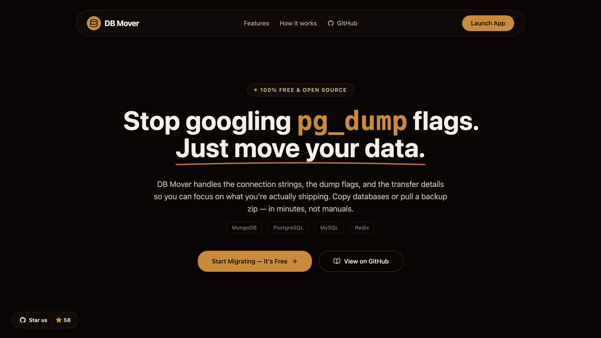

# DB MOVER

<div align="center">
  
</div>

<div align="center">

**The High-Performance Database Relocation Engine**

[](https://creativecommons.org/licenses/by-nc/4.0/)
[](https://github.com/JC-Coder/db-mover)

</div>

---

## Support the Project

Support the development of **DB Mover** by holding **$DBM** on Bags!

**Link:** [$DBM](https://bags.fm/D3dwm8wTN7f4qvWSqavXL1FgEdm7aN2W8ZYVS8iKBAGS)  
**CA:** `D3dwm8wTN7f4qvWSqavXL1FgEdm7aN2W8ZYVS8iKBAGS`

---

## 🚀 Overview

**DB Mover** is an open-source, enterprise-grade migration engine designed to make database relocation seamless. It eliminates the complexity of CLI tools, manual dump management, and connection string wrestling.

With a focus on **Visual-First** operations, DB Mover allows you to stream entire datasets between cloud providers with zero structural loss and sub-second visual tracking.

## ✨ Features

- **🚫 No CLI Required**: Stop wrestling with `mongodump`, `pg_dump`, or `redis-cli`. Manage everything via a premium dark-mode interface.
- **🔥 Firebase Master Class**: Specialized adapters for **Firestore** (recursive deep-copy up to 15 levels) and **Realtime Database**.
- **⚡ SSE-Powered Progress**: Real-time event streaming via **Server-Sent Events (SSE)** for zero-latency logs and progress tracking.
- **📊 Visual Analytics**: Beautifully crafted dashboards using **Recharts** to track data volume, records processed, and migration health.
- **🔒 Secure & Ephemeral**: Your credentials never touch persistent storage. Data is streamed in-memory via high-performance pipes.
- **📦 Direct Transfer vs. Dumps**: Choose between a direct live-sync (source → target) or a one-click compressed backup of your entire structure.

## 🗄️ Supported Ecosystems

| Database | Support Level | Features |
| :--- | :--- | :--- |
| **MongoDB** | Full | Auth Support, Collection Streaming |
| **PostgreSQL**| Full | Schema integrity, Table migration |
| **MySQL** | Full | Relational mapping, Fast-pipe streaming |
| **Redis** | Full | Key-Value mirroring |
| **Firebase** | **Advanced** | Firestore (Deep Copy), RTDB Support |
| **BigQuery** | _Roadmap_ | Coming soon |

## 🛠️ Tech Stack

- **Frontend**: React 18, Vite, Tailwind CSS, Framer Motion, Radix UI.
- **Visualization**: Recharts (SVG-based high-performance charts).
- **Backend**: Node.js, **Hono** (High-performance, type-safe API framework).
- **Architecture**: Streaming-based data pipeline with **BulkWriter** optimizations for NoSQL.

## 🚀 Getting Started

### Prerequisites

- Node.js (v18 or higher)
- npm or yarn

### Installation

1.  **Clone the repository**
    ```bash
    git clone https://github.com/JC-Coder/db-mover.git
    cd db-mover
    ```

2.  **Install dependencies**
    ```bash
    npm run install:all
    ```

3.  **Start the development engine**
    ```bash
    npm run dev
    ```
    *Client will be available at http://localhost:5173*
    *Server will be available at http://localhost:3000*

## 🐳 Deployment

Quickly spin up the mover using Docker:
```bash
docker build -t db-mover .
docker run -p 3000:3000 db-mover
```

## 🤝 Contributing

We welcome contributions! Whether it's adding a new database adapter or improving the UI, please see our [CONTRIBUTING.md](CONTRIBUTING.md).

## 📄 License

This project is licensed under the **Creative Commons Attribution-NonCommercial 4.0 International (CC BY-NC 4.0)**.

---
Disclaimer: I am the designated royalty recipient for the $DBM token via Bags.fm. I am not the creator or developer of this token.
